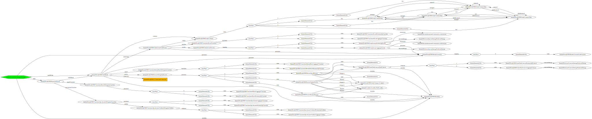

# Neo4j-ONM

[](https://github.com/Innmind/neo4j-onm/actions?query=workflow%3ACI)
[](https://codecov.io/gh/Innmind/neo4j-onm)
[](https://shepherd.dev/github/Innmind/neo4j-onm)

This an _ORM_ for the [Neo4j](http://neo4j.com/) graph database, with an emphasis on Domain Driven Design (DDD). It will allow you to easily build `Entities`, `Repositories` and query them via `Specification`s. Another important aspect is that each block of this library is fully replaceable.

## Installation

Run the following command to add this library to your project via composer:

```sh
composer require innmind/neo4j-onm
```

## Documentation

### Structure

This library aims at persisting 2 types of objects: `Aggregate` and `Relationship` (both are entities).  The first one represent a node in Neo4j, and can have a set of sub nodes linked to it. Only the main node contains an `Identity` and the sub nodes can't be queried outside their aggregates. The `Relationship` represent a relationship in Neo4j. It always contains an `Identity` and the 2 identities representing the aggregates at the start and end of the relationship.

As described by the DDD, entities objects are not directly linked to each other; instead they contains identities of the entities they point to. However, when those entities are persisted in the graph, the relationships are correctly set as you would expect (allowing any other script to query your graph normally).
For example, if you would like 2 `Aggregate`s to be connected to each other you would create a new `Relationship` containing the identities of both aggregates; hence you would have to persist 3 objects.

Each entity is fully managed by its own `Repository`, meaning it's used to `add`, `remove`, `get` and query entities.

**Note**: for performance issues, when you `add` an entity to its repository it's not directly inserted in the graph.

To access an entity repository, you'll use a `Manager` which only contains 4 methods: `connection`, `repository`, `flush` and `identities`. The first one gives you access to the DBAL [`Connection`](https://github.com/Innmind/neo4j-dbal/blob/master/Connection.php) so you can open/commit transactions. The method `repository` takes the entity class in order to return the associated repository. `flush` will persist in the graph all of your modifications from your repositories. Finally, `identities` allows you to generate a new identity of the specified type

When you `flush` the sequence of how the modifications are persisted is as follow:

* insert new aggregates
* insert new relationships (in the same query as aggregates)
* update all entities (without any particular order)
* remove relationships
* remove aggregates (in the same query as relationships)

### Configuration

You're first job is to write the mapping of your entities. Here's a complete example of what you can specify:

```php
use Innmind\Neo4j\ONM\{
    Metadata\Aggregate,
    Metadata\Aggregate\Child,
    Metadata\Relationship,
    Metadata\ClassName,
    Metadata\Identity,
    Metadata\RelationshipType,
    Metadata\RelationshipEdge,
    Type,
    Type\StringType,
    Type\DateType,
    Identity\Uuid,
};
use Innmind\Immutable\{
    Map,
    Set,
};

$image = Aggregate::of(
    new ClassName('Image'),
    new Identity('uuid', Uuid::class),
    Set::of('string', 'Image'), # labels
    Map::of('string', Type::class)
        ('url', new StringType),
    Set::of(
        Child::class,
        Child::of(
            new ClassName('Description'),
            Set::of('string', 'Description'), # labels
            Child\Relationship::of(
                new ClassName('DescriptionOf'),
                new RelationshipType('DESCRIPTION_OF'),
                'rel',
                'description',
                Map::of('string', Type::class)
                    ('created', new DateType)
            ),
            Map::of('string', Type::class)
                ('content', new StringType)
        )
    )
);
$relationship = Relationship::of(
    new ClassName('SomeRelationship'),
    new Identity('uuid', Uuid::class),
    new RelationshipType('SOME_RELATIONSHIP'),
    new RelationshipEdge('startProperty', Uuid::class, 'uuid'),
    new RelationshipEdge('endProperty', Uuid::class, 'uuid'),
    Map::of('string', Type::class)
        ('created', new DateType)
);
```

### Usage

The first step is to create a manager:

```php
use function Innmind\Neo4j\ONM\bootstrap;
use Innmind\Neo4j\DBAL\Connection;
use Innmind\Immutable\Set;

$services = bootstrap(
    /* instance of Connection */,
    Set::of(Entity::class, $image, $relationship)
);

$manager = $services['manager'];
```

Now that you have a working manager, let's handle our entities:

```php
$images = $manager->repository(Image::class);
$rels = $manager->repository(SomeRelationship::class);
$image1 = new Image($manager->identities()->new(Uuid::class));
$image2 = new Image($manager->identities()->new(Uuid::class));
$rel = new SomeRelationship(
    $manager->identities()->new(Uuid::class),
    $image1->uuid(),
    $image2->uuid()
);

$rels->add($rel);
$images
    ->add($image1)
    ->add($image2);
$manager->flush();
```

The example above will create the given path in your graph: `(:Image {uuid: "some value"})-[:SOME_RELATIONSHIP {uuid: "some value"}]->(:Image {uuid: "some value"})`.

So, even if in your objects there's no direct link between your aggregates and the relationship, it creates a concrete path in your graph. Consequently, if you try the code below, it will throw an exception saying you can't delete your aggregate as it's part of a relationship preventing you creating inconsistencies.

```php
$images->remove($image1);
$manager->flush(); //throw an exception at the database level
```

However the following code would work if you really need to delete the aggregate.

```php
$images->remove($image1);
$rels->remove($rel);
$manager->flush();
```

**Note**: as said earlier, the order of the `remove` calls doesn't matter as the library will always remove relationships (only the ones you asked for removal of course) before the aggregates to prevent unexpected exceptions from the database.

### Querying

Now that you know how to add/remove, let's learn how query our entities back from the graph.

```php
$image = images->get(new Uuid($_GET['wished_image_id']));
```

**Note**: the usage of `$_GET` here is only to be framework agnostic, but even if you'd use it would be pretty safe as `Uuid` validates the data (as you can see [here](Identity/Uuid.php#L20)).

But accessing entities through their identifiers is not enough, that's why a repository as a method called `matching` which allows only a single parameter that has to be a [specification](https://github.com/Innmind/Specification).

A specification is a good fit for querying objects as this pattern aims at verifying if an object match a certain criteria, which is what we want to accomplish when retrieving our entities. The advantage with this is that it removes duplication in your codebase; no more specific query language to query your objects.

Example:

```php
$entities = $images->matching(
    $spec = (new ImageOfDomain('example.org'))
        ->or(new ImageOfDomain('antoher.net'))
        ->and((new ImageOfDomain('exclude.net'))->not())
);
```

Here `ImageOfDomain` would use the image `url` to check if it's one of the wished one. The library can translate any tree of specification into a valid cypher query. And because `ImageOfDomain` should implement a method like `isSatisfiedBy` you can reuse `$spec` to validate any `Image` elsewhere in your code.

### Overriding defaults

The library is decoupled enough so most of its building blocks an be easily replaced, allowing you to improve it if you feel limited in your use case.

#### Types

By default there's only 7 types you can use for your entities' properties:

* `ArrayType`
* `BooleanType`
* `DateType`
* `FloatType`
* `IntType`
* `SetType` (similar as `ArrayType` except it uses the immutable [`Set`](https://github.com/Innmind/Immutable#set))
* `StringType`

To add your own type you need to create a class implementing [`Type.php`](Type.php).


#### Entity Translators

When querying the graph to load your entities, there's a step where the result returned from connection is translated into a collection of raw structured data that look like the structure of your entities. This data is afterward used by factories to create your entities.

In case you've built a new kind of entity metadata, you'll need to create a new translator.

```php
use Innmind\Neo4jONM\Translation\EntityTranslator;
use Innmind\Immutable\Map;

class MyTranslator implements EntityTranslator
{
    // your implementation ...
}

$services = bootstrap(
    /* instance of Connection */,
    Set::of(Entity::class),
    null,
    null,
    null,
    null,
    null,
    Map::of('string', EntityTranslator::class)
        (MyEntityMetadata::class, new MyTranslator)
);
```

#### Entity factories

By default the library use 2 factories to translate raw data into your entities and both relies on the library [`Reflection`](https://github.com/Innmind/Reflection) to build objects.

In case your entity is too complex to be built via the default tools, you can build your own entity factory to resolve your limitation.

```php
use Innmind\Neo4j\ONM\EntityFactory;

class MyEntityFactory implements EntityFactory
{
    // your implementation
}

$services = bootstrap(
    /* instance of Connection */,
    Set::of(Entity::class),
    null,
    null,
    null,
    null,
    Set::of(EntityTranslator::class, new MyEntityFactory)
);
```

**Note**: for your factory to be really used, you'll need in the mapping of your entity to specify the class of your factory.

#### Identity generators

By default this library only use UUIDs as identity objects. But you can easily add your own kind of identity object.

You need to create the identity class implementing [`Identity`](Identity.php) and the corresponding generator implementing [`Generator`](Identity/Generator.php).

```php
use Innmind\Neo4j\ONM\{
    Identity,
    Identity\Generator
};

class MyIdentity implements Identity
{
    // your implementation ...
}

class MyIdentityGenerator implements Generator
{
    // your implementation
}

$services = bootstrap(
    /* instance of Connection */,
    Set::of(Entity::class),
    Map::of('string', Generator::class)
        (MyIdentity::class, new MyIdentityGenerator)
);
```

## Object graph


